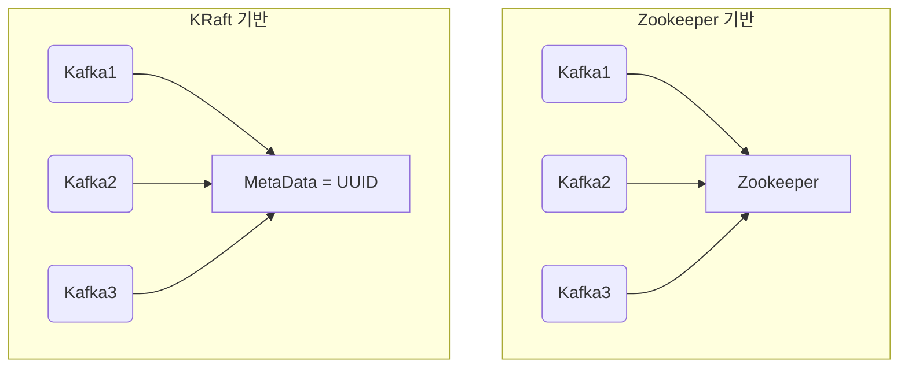

## 3.1 카프카 기초 다지기

### 3.1.1 리플리케이션

Kafka는 데이터의 안정성을 위해 리플리케이션(Replication)을 지원한다. 하나의 파티션은 여러 개의 브로커에 복제될 수 있으며, 이때 주 복제본(leader)과 복제본(follower)으로 나뉜다. 프로듀서는 항상 리더에 쓰고, 컨슈머는 리더에서 읽는다.

> ✅ 리플리케이션 팁: replication.factor 값을 설정할 때는 브로커 수보다 작거나 같게 설정해야 한다.
>

### 3.1.2 파티션

Kafka 토픽은 하나 이상의 파티션으로 구성되며, 각 파티션은 독립된 로그 구조를 가진다. 파티션은 병렬 처리를 가능하게 하며, 확장성과 처리량 향상에 기여한다.

```bash
# 파티션이 3개인 토픽 생성
kafka-topics.sh --create --bootstrap-server localhost:9092 --replication-factor 1 --partitions 3 --topic my-topic
```


### 3.1.3 세그먼트

파티션 로그는 내부적으로 세그먼트(segment) 파일로 나뉜다. 각 세그먼트는 일정 크기나 시간이 지나면 새로운 파일로 교체된다. 이는 디스크 I/O 최적화 및 로그 관리에 도움을 준다.

## 3.2 카프카의 핵심 개념

### 3.2.1 분산 시스템

### 3.2.2 페이지 캐시

Kafka는 디스크에서 직접 데이터를 읽기보다는 OS의 페이지 캐시를 활용해 성능을 향상시킨다. 이는 메모리 기반의 캐싱으로 디스크 접근을 줄인다.

Kafka 는 브로커에서 메시지를 세그먼트 파일로 저장하기때문에 IO 가 많이 발생하고 이에따라 디스크IO 에 대한 병목이 생긴다. 이때 Kafka 는 OS (Operation System) 의 버퍼캐시(page cache) 를 활용한다. 필요한 부분의 세그먼트 데이터를 디스크 블록정보를 메모리에 저장해두고 메모리영역에서 읽고/쓰기 작업을 하므로써 응답 시간을 줄여 성능을 높인다.

### 3.2.3 배치 전송 처리

Kafka 프로듀서는 메시지를 하나씩 전송하지 않고 배치로 묶어 전송한다. 이 배치 전송은 네트워크 비용 절감과 처리량 향상에 기여한다.

```kotlin
val props = Properties().apply {
    put("bootstrap.servers", "localhost:9092")
    put("key.serializer", "org.apache.kafka.common.serialization.StringSerializer")
    put("value.serializer", "org.apache.kafka.common.serialization.StringSerializer")
    put("batch.size", 16384)  // 기본값
    put("linger.ms", 5)
}
```

### 3.2.4 압축 전송

Kafka는 `gzip`, `snappy`, `lz4`, `zstd`와 같은 압축 알고리즘을 지원하여 네트워크와 저장공간을 절약한다.

```kotlin
props["compression.type"] = "gzip"
```

### 3.2.5 토픽, 파티션, 오프셋

- **토픽(Topic)**: 메시지를 분류하는 단위
- **파티션**: 토픽 내 데이터 저장 단위
- **오프셋(Offset)**: 각 파티션 내 메시지의 고유한 위치

### 3.2.6 고가용성 보장

리더-팔로워 구조와 리플리케이션을 통해 브로커 장애에도 데이터 유실 없이 안정적으로 서비스 제공이 가능하다.

### 3.2.7 주키퍼의 의존성

Kafka는 클러스터 메타데이터를 저장하고 컨트롤러 선출을 위해 Zookeeper를 사용한다. 단, 최신 Kafka (2.8 이후)에서는 Zookeeper 없이 동작하는 KRaft 모드도 제공된다.

> ⚠️ Kafka 3.x 이상에서는 KRaft 모드를 정식으로 지원하며, Zookeeper 없이 Kafka 클러스터를 구성할 수 있다. 이때는 `process.roles`, `controller.quorum.voters`, `node.id` 등을 설정해야 한다.
>

## 3.3 프로듀서의 기본 동작과 예제 맛보기

### 3.3.1 프로듀서 디자인

Kafka 프로듀서는 메시지를 브로커에 전송하는 클라이언트이다. 내부적으로는 버퍼링, 배치, 리트라이 등의 로직이 존재한다.

### 3.3.2 프로듀서의 주요 옵션

- `acks`: 응답 보장 수준 (0, 1, all)
- `retries`: 실패 시 재전송 횟수
- `linger.ms`: 배치 전송을 위한 대기 시간

### 3.3.3 프로듀서 예제

```kotlin
val producer = KafkaProducer<String, String>(props)
val record = ProducerRecord("my-topic", "key", "value")
producer.send(record) { metadata, exception ->
    if (exception == null) println("Sent to ${metadata.topic()}-${metadata.partition()} offset ${metadata.offset()}")
    else exception.printStackTrace()
}
producer.close()
```

## 3.4 컨슈머의 기본 동작과 예제 맛보기

### 3.4.1 컨슈머의 기본 동작

Kafka 컨슈머는 브로커로부터 메시지를 pull 방식으로 가져온다. 오프셋을 기반으로 다음 메시지를 추적하며, 컨슈머 그룹 단위로 병렬 처리가 가능하다.

### 3.4.2 컨슈머의 주요 옵션

### 3.4.3 컨슈머 예제

### 3.4.4 컨슈머 그룹의 이해

```yaml
version: '3.8'
services:
  kafka1:
    image: confluentinc/cp-kafka:7.5.0
    container_name: kafka1
    hostname: kafka1
    ports:
      - "19092:9092"
    environment:
      KAFKA_PROCESS_ROLES: broker,controller
      KAFKA_NODE_ID: 1
      KAFKA_CONTROLLER_QUORUM_VOTERS: "1@kafka1:9093,2@kafka2:9093,3@kafka3:9093"
      KAFKA_LISTENERS: PLAINTEXT://0.0.0.0:9092,CONTROLLER://0.0.0.0:9093
      KAFKA_ADVERTISED_LISTENERS: PLAINTEXT://localhost:19092
      KAFKA_LISTENER_SECURITY_PROTOCOL_MAP: PLAINTEXT:PLAINTEXT,CONTROLLER:PLAINTEXT
      KAFKA_INTER_BROKER_LISTENER_NAME: PLAINTEXT
      KAFKA_CONTROLLER_LISTENER_NAMES: CONTROLLER
      KAFKA_LOG_DIRS: /tmp/kraft-combined-logs
      CLUSTER_ID: "tUeiYSM4QW2qCFizw1jz8Q"

  kafka2:
    image: confluentinc/cp-kafka:7.5.0
    container_name: kafka2
    hostname: kafka2
    ports:
      - "19093:9092"
    environment:
      KAFKA_PROCESS_ROLES: broker,controller
      KAFKA_NODE_ID: 2
      KAFKA_CONTROLLER_QUORUM_VOTERS: "1@kafka1:9093,2@kafka2:9093,3@kafka3:9093"
      KAFKA_LISTENERS: PLAINTEXT://0.0.0.0:9092,CONTROLLER://0.0.0.0:9093
      KAFKA_ADVERTISED_LISTENERS: PLAINTEXT://localhost:19093
      KAFKA_LISTENER_SECURITY_PROTOCOL_MAP: PLAINTEXT:PLAINTEXT,CONTROLLER:PLAINTEXT
      KAFKA_INTER_BROKER_LISTENER_NAME: PLAINTEXT
      KAFKA_CONTROLLER_LISTENER_NAMES: CONTROLLER
      KAFKA_LOG_DIRS: /tmp/kraft-combined-logs
      CLUSTER_ID: "tUeiYSM4QW2qCFizw1jz8Q"

  kafka3:
    image: confluentinc/cp-kafka:7.5.0
    container_name: kafka3
    hostname: kafka3
    ports:
      - "19094:9092"
    environment:
      KAFKA_PROCESS_ROLES: broker,controller
      KAFKA_NODE_ID: 3
      KAFKA_CONTROLLER_QUORUM_VOTERS: "1@kafka1:9093,2@kafka2:9093,3@kafka3:9093"
      KAFKA_LISTENERS: PLAINTEXT://0.0.0.0:9092,CONTROLLER://0.0.0.0:9093
      KAFKA_ADVERTISED_LISTENERS: PLAINTEXT://localhost:19094
      KAFKA_LISTENER_SECURITY_PROTOCOL_MAP: PLAINTEXT:PLAINTEXT,CONTROLLER:PLAINTEXT
      KAFKA_INTER_BROKER_LISTENER_NAME: PLAINTEXT
      KAFKA_CONTROLLER_LISTENER_NAMES: CONTROLLER
      KAFKA_LOG_DIRS: /tmp/kraft-combined-logs
      CLUSTER_ID: "tUeiYSM4QW2qCFizw1jz8Q"

  kafka-ui:
    image: provectuslabs/kafka-ui:latest
    container_name: kafka-ui
    ports:
      - "8989:8080"
    environment:
      KAFKA_CLUSTERS_0_NAME: kraft-cluster
      KAFKA_CLUSTERS_0_BOOTSTRAPSERVERS: kafka1:9092,kafka2:9092,kafka3:9092
```

CLUSTER_ID 생성방법
```shell
docker run --rm bitnami/kafka:3.6.1 kafka-storage.sh random-uuid
=> O0l-HBAiRmawtFPn_H4l8w
```

### 3.5.1 Kafka KRaft 클러스터 구성 (Confluent 기반)

Kafka에서 "클러스터"란, 여러 개의 Kafka 브로커 인스턴스가 하나로 묶여 있는 구조를 의미한다. 클러스터는 토픽, 파티션, 리플리케이션 등 Kafka의 핵심 기능을 제공하며, 브로커 간 협업을 통해 고가용성과 분산처리를 가능하게 만든다.

**Cluster ID**는 이러한 Kafka 클러스터를 고유하게 식별하는 UUID 값으로, KRaft 모드에서는 반드시 명시적으로 제공해야 한다. 이는 클러스터 내 모든 브로커가 같은 클러스터에 속함을 증명하는 기준이 된다.

> 🧠 왜 KRaft에서는 CLUSTER_ID가 필요한가?
>
>
> Zookeeper 기반 Kafka에서는 메타데이터와 클러스터 구성 정보를 모두 Zookeeper가 저장하고 관리했기 때문에, 브로커는 단순히 Zookeeper에 접속하면 클러스터에 자동으로 참여할 수 있었다.
>
> 하지만 KRaft에서는 Kafka 자체가 메타데이터 저장소 역할을 수행하기 때문에, 클러스터를 최초 초기화할 때 `CLUSTER_ID`를 명시적으로 부여하고 디스크에 저장해야 한다. 이를 통해 브로커들은 동일한 클러스터에 속함을 인식한다.
>


